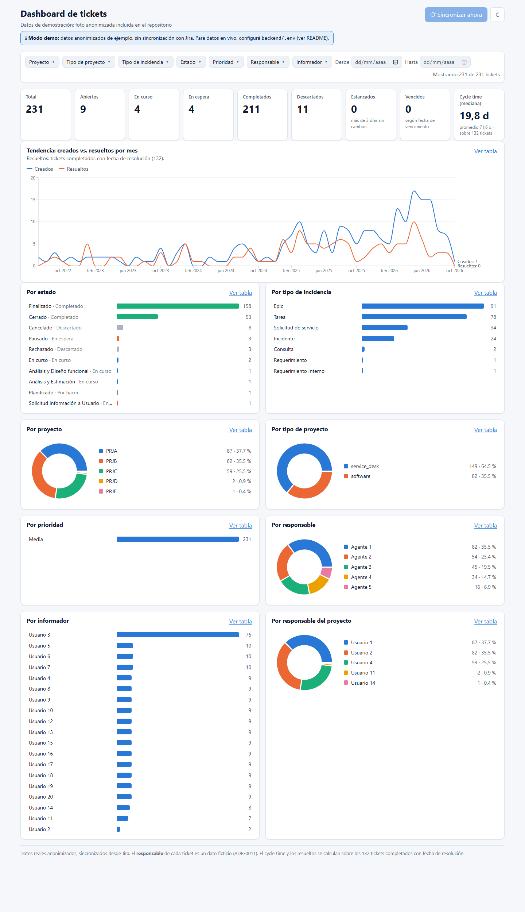

# Dashboard de tickets

Dashboard con backend propio que muestra el **estado real** de los tickets de Jira, sin
cargar nada a mano: el backend sincroniza contra la API de Jira cada 5 minutos y el
frontend consume solo la API propia.

> **Estado:** las 8 etapas están completas: estructura, anonimización, carga a Jira, sync,
> métricas, endpoints, UI y modo demo. Ver el plan en
> [ADR-0009](docs/adr/0009-proceso-por-etapas.md).

<picture>
  <source media="(prefers-color-scheme: dark)" srcset="docs/capturas/escritorio-oscuro.png">
  
</picture>

<sub>Captura en modo demo (231 tickets anonimizados). El dashboard tiene modo claro y oscuro;
GitHub muestra el que coincide con tu tema. Ver también la
[versión clara](docs/capturas/escritorio-claro.png) y la
[versión oscura](docs/capturas/escritorio-oscuro.png).</sub>

**Qué muestra:** 9 KPIs (total, abiertos, en curso, en espera, completados, descartados,
estancados, vencidos y cycle time), la tendencia mensual de creados vs. resueltos y 8
distribuciones. Todo se filtra con los segmentadores, el rango de fechas o haciendo clic en
cualquier barra o porción; los filtros quedan en la URL para compartir la vista.

## Arquitectura

```
Jira (API) ──sync cada 5 min──► backend (Express + SQLite) ──API REST──► frontend (React)
```

| Carpeta            | Contenido                                                                |
| ------------------ | ------------------------------------------------------------------------ |
| `backend/`         | API propia (Node + Express + TypeScript)                                 |
| `frontend/`        | Dashboard (React + Vite + Recharts)                                      |
| `packages/shared/` | Tipos y lógica compartida entre backend y frontend                       |
| `seed/`            | Scripts de anonimización y carga a Jira (se usan una sola vez)           |
| `tools/`           | Utilidades del repo (verificación de archivos en el pre-commit)          |
| `docs/adr/`        | Decisiones de arquitectura                                               |
| `docs/specs/`      | Especificación de cada etapa                                             |
| `data/`            | Datos locales (export real de Jira). **Ignorada por git, nunca se sube** |

## Requisitos

- Node.js 24 LTS (ver `.nvmrc`)
- npm (incluido con Node)

## Probarlo en 2 minutos (modo demo)

```bash
git clone https://github.com/maruwhite/Dashboard-de-ticktets.git
cd Dashboard-de-ticktets
npm install
npm run dev
```

Abrir http://localhost:5173. Sin configurar nada, el backend arranca en **modo demo**: carga
una foto de 231 tickets **anonimizados** (`backend/demo/tickets.json`) y el dashboard funciona
completo (KPIs, gráficos, filtros, tendencia). Un aviso en pantalla indica que es una demo sin
sincronización. Ver [ADR-0014](docs/adr/0014-modo-demo.md).

## Con datos en vivo desde Jira

```bash
cp backend/.env.example backend/.env   # completar JIRA_BASE_URL, credenciales e ids de campos
npm run dev
```

Con `JIRA_BASE_URL` configurado, el backend sincroniza los tickets de Jira en SQLite al
arrancar y cada 5 minutos, y el botón "Sincronizar ahora" fuerza un sync.

- Frontend: http://localhost:5173
- Backend: http://localhost:3000/api/health

## Datos de prueba en Jira

Los datos del dashboard vienen de un Jira Cloud de prueba, poblado una única vez a partir de
un export real **anonimizado** ([etapa 2](docs/specs/etapa-2-anonimizacion.md),
[etapa 3](docs/specs/etapa-3-carga-a-jira.md)):

```bash
npm run anonimizar -w seed                   # data/Tickets_jira.xlsx → data/anonimizado/
npm run jira:preparar -w seed -- --confirmar # configura el sitio de Jira
npm run jira:cargar -w seed -- --confirmar   # carga los tickets
```

Sin `--confirmar`, los dos últimos corren en modo simulación. El **responsable** de cada
ticket es un dato ficticio ([ADR-0011](docs/adr/0011-reparto-de-personas.md)); el resto de
los campos refleja datos reales anonimizados.

## Validaciones

| Comando                 | Qué hace                                                                  |
| ----------------------- | ------------------------------------------------------------------------- |
| `npm run check`         | Todo lo que corre el CI: formato, lint, tipos, tests con coverage y build |
| `npm run format`        | Formatea con Prettier                                                     |
| `npm run lint`          | ESLint estricto, cero warnings                                            |
| `npm run typecheck`     | TypeScript strict en todos los workspaces                                 |
| `npm test`              | Tests (Vitest)                                                            |
| `npm run test:coverage` | Tests con coverage mínimo del 80 %                                        |

Cada commit pasa por un hook de pre-commit (formato, lint, tipos y tests) que además
rechaza archivos de `data/`, `.env`, planillas y CSV. Cada push y pull request a `main`
corre el CI en GitHub Actions.

## Datos y seguridad

- El export real de Jira se anonimiza antes de cargarlo en un Jira de prueba: ver
  [ADR-0003](docs/adr/0003-anonimizacion.md). Ningún dato real aparece en el repo.
- Las credenciales van solo en `backend/.env`. El token de Jira nunca llega al frontend ni a
  los logs: ver [ADR-0008](docs/adr/0008-seguridad.md).

## Documentación

- [Decisiones de arquitectura (ADR)](docs/adr/README.md)
- [Especificaciones por etapa](docs/specs/)
